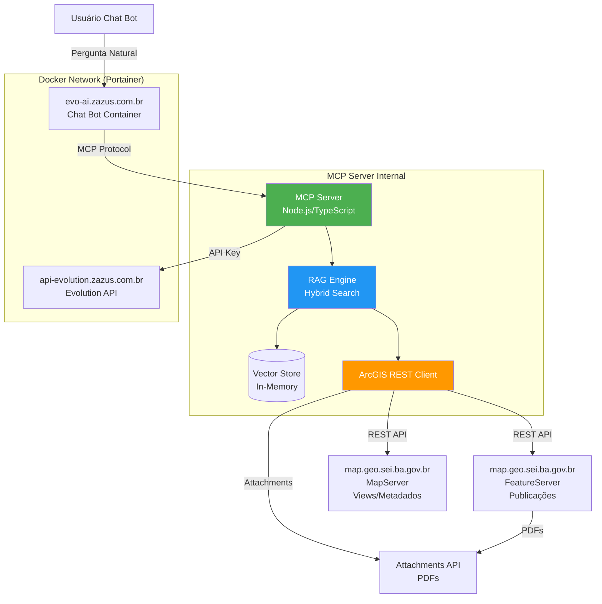

# MCP Server para Mapoteca Digital - Fullstack Architecture Document

## Introduction

Este documento outline a arquitetura completa do **MCP Server para Mapoteca Digital**, incluindo sistemas backend, integrações com serviços ArcGIS, implementação de Hybrid RAG (Retrieval-Augmented Generation) e conectividade com o Chat Bot existente. Ele serve como a única fonte de verdade para o desenvolvimento AI-driven, garantindo consistência em toda a stack tecnológica.

O MCP Server atuará como uma camada de inteligência intermediária entre:
- **Chat Bot da Mapoteca** (evo-ai.zazus.com.br)
- **Serviços ArcGIS** (FeatureServer e MapServer)
- **Sistema Evolution API** (api-evolution.zazus.com.br)

Esta abordagem unificada combina padrões tradicionais de API serverless com técnicas modernas de RAG para criar um sistema de recuperação de contexto enriquecido que permite respostas inteligentes baseadas nos metadados completos das publicações cartográficas e seus anexos PDF.

**Starter Template or Existing Project:** N/A - Greenfield project (MCP Server é um novo componente na arquitetura existente)

### Change Log

| Date | Version | Description | Author |
|------|---------|-------------|---------|
| 2025-11-19 | 1.0 | Initial architecture creation | Winston (Architect) |

## High Level Architecture

### Technical Summary

O MCP Server para Mapoteca Digital adota uma arquitetura **serverless otimizada para AI** usando Node.js com TypeScript, implantada como container Docker na infraestrutura Portainer existente. O sistema implementa padrão **Hybrid RAG** combinando busca vetorial (semantic search) com consultas estruturadas aos serviços ArcGIS REST API, fornecendo contexto geográfico enriquecido para o Chat Bot existente. A arquitetura prioriza tempo de desenvolvimento rápido (sem cache inicial) com evolução gradual para performance otimizada, integrando-se perfeitamente com o ecossistema ArcGIS Enterprise existente da Mapoteca Digital.

### Platform and Infrastructure Choice

**Platform:** Docker Containers (Portainer na VPS existente)
**Key Services:**
- **Runtime:** Node.js 20+ com Alpine Linux
- **Orchestration:** Portainer Stacks (docker-compose)
- **Network:** Docker internal network para comunicação com evo-ai e api-evolution
- **Storage:** Bind mounts para logs e configurações

**Deployment Host and Regions:**
- **VPS Localização:** Brasil (zazus.com.br domain)
- **Ambiente:** Homologação (HML) conectado aos serviços ArcGIS HML
- **Escala:** Single container com possibilidades de horizontal scaling

**Rationale:**
- Aproveita infraestrutura Docker/Portainer já existente
- Zero overhead de orquestração Kubernetes (overkill para MVP)
- Facilita desenvolvimento iterativo e testes locais
- Comunicação interna via Docker network elimina necessidade de exposição pública

### Repository Structure

**Structure:** Monorepo simples com workspaces npm
**Monorepo Tool:** npm workspaces (builtin, sem dependências externas)
**Package Organization:**
```
mcp-server-mapoteca/
├── packages/
│   ├── mcp-server/          # Servidor MCP principal
│   ├── arcgis-client/       # Cliente ArcGIS REST API (shared)
│   ├── rag-engine/          # Motor de RAG híbrido (shared)
│   └── shared-types/        # TypeScript types compartilhados
├── apps/
│   └── admin-panel/         # Painel admin (opcional, futuro)
├── docker/                  # Configurações Docker
│   ├── Dockerfile.mcp-server
│   └── docker-compose.yml
└── scripts/                 # Scripts de deploy e manutenção
```

**Rationale:**
- Separação clara de preocupações (client, RAG, server)
- Packages shared podem ser reutilizados futuramente em outros projetos
- Facilita testes isolados de cada componente
- Estrutura simples que pode evoluir para Turborepo se necessário

### Architecture Diagram



### Architectural Patterns

- **Hybrid RAG Pattern:** Combina busca vetorial semântica com consultas estruturadas ArcGIS - _Rationale:_ Permite descoberta por similaridade (usuário não sabe termos exatos) + precisão geográfica (filtros de escala/tema/região)

- **Repository Pattern (ArcGIS Client):** Abstrai complexidade da ArcGIS REST API - _Rationale:_ Facilita testes com mocks e futura migração para GraphQL/outras APIs

- **Adapter Pattern (MCP Protocol):** Adapta dados ArcGIS para formato MCP esperado pelo Chat Bot - _Rationale:_ Desacopla schema ArcGIS mutável de contrato MCP estável

- **Strategy Pattern (Search Strategies):** Múltiplas estratégias de busca (semantic, filtered, hybrid) - _Rationale:_ Permite otimizar busca baseado no tipo de pergunta do usuário

- **Dependency Injection:** Todas as dependências injetadas via construtor - _Rationale:_ Facilita testes unitários e troca de implementações (ex: vector store)

- **Observer Pattern (Cache Invalidation):** Event-driven para invalidar cache quando ArcGIS atualiza - _Rationale:_ Futura implementação de cache sem comprometer consistência de dados

## Tech Stack

Esta é a seleção DEFINITIVA de tecnologias para todo o projeto. Todas as escolhas foram otimizadas para desenvolvimento rápido de MCP Server com capacidades Hybrid RAG, integração ArcGIS e implantação Docker/Portainer.

| Category | Technology | Version | Purpose | Rationale |
|----------|-----------|---------|---------|-----------|
| **Backend Language** | TypeScript | 5.3+ | Tipo seguro para MCP Server | Type safety previne bugs em tempo de compilação; excelente suporte IDE para desenvolvimento rápido |
| **Backend Framework** | Fastify | 4.25+ | API server do MCP | Mais rápido que Express (3x); schema validation embutida; plugin architecture ideal para MCP |
| **RAG/Vector Engine** | LangChain.js | 0.1+ | Orquestração RAG e embeddings | Padrão industry para RAG; abstrai complexidade de vector stores; integração com múltiplos embedding models |
| **Embedding Model** | Transformers.js | 2.16+ | Geração de embeddings local | Modelo local sem custos de API; privacy de dados (não sai da VPS); modelo multilingue PT-BR |
| **Vector Store** | MemoryVectorStore | LangChain builtin | Armazenamento de embeddings | Zero configuração para MVP; performance excelente para 377 documentos; migração futura para pgvector/Redis |
| **ArcGIS Client** | @arcgis/core REST JS | 4.28+ | Comunicação ArcGIS REST API | Biblioteca oficial ESRI; mantida atualizada; suporte completo a FeatureServer/MapServer |
| **HTTP Client** | Undici | 6.0+ | Requisições HTTP performáticas | Client HTTP nativo Node.js 20; mais rápido que axios; better connection pooling |
| **API Authentication** | helmet-fastify-keycloak | 12.0+ | API Key validation | Proteção simples via header; rate limiting embutido; zero dependências externas |
| **Environment Config** | dotenv-safe | 9.0+ | Variáveis de ambiente | Valida schema de .env; previne deployment sem variáveis obrigatórias; type-safe config |
| **Logging** | Pino | 9.0+ | Logs estruturados JSON | Logs JSON nativos; performance superior ao console.log; integração Portainer logs |
| **Error Handling** | fastify-error-handler | 4.0+ | Tratamento uniforme de erros | Error responses padronizadas; suporte a error codes; detalhes em development |
| **Testing Framework** | Vitest | 1.1+ | Testes unitários/integração | Compatibility com Vite; TypeScript nativo; mocking simplificado; test watches rápidos |
| **HTTP Testing** | Supertest | 7.0+ | Testes de API endpoints | Testa Fastify endpoints sem servidor real; assertions fluentes; integration testing |
| **E2E Testing** | Playwright | 1.40+ | Testes end-to-end MCP | Testa fluxo completo usuário→Chat Bot→MCP→ArcGIS; suporte a Docker containers; API fixtures |
| **Build Tool** | tsx | 4.7+ | Execução TypeScript em dev | Zero-config TypeScript executor; watch mode rápido; sem necessidade de build step |
| **Bundler** | esbuild | 0.19+ | Build de produção | Bundling extremamente rápido (Go-written); tree-shaking agressivo; minificação embutida |
| **Package Manager** | npm workspaces | builtin | Monorepo management | Built-in no Node.js 20+; sem dependências externas; lockfile único |
| **Docker Base Image** | node:20-alpine | 20.13+ | Runtime container | Imagem pequena (~50MB); security patches frequentes; Alpine Linux minimal |
| **Docker Orchestration** | docker-compose | 2.23+ | Multi-container setup | Padrão de facto; integração Portainer; variáveis de ambiente consistentes |
| **CI/CD** | GitHub Actions | Latest | Pipeline de deploy | Free para repos públicos; integração nativa com Docker; self-hosted runners na VPS |
| **Monitoring** | Prometheus-fastify-metrics | 5.0+ | Métricas de performance | Exporta métricas Prometheus; integração futura com Grafana; overhead mínimo |
| **Process Management** | PM2 | 5.3+ | Process manager em container | Auto-restart; cluster mode; log management integrado |

---

## 📋 Seção 14: Coding Standards

### 📄 Conteúdo da Seção

Padrões mínimos e CRÍTICOS de codificação para agentes AI e desenvolvedores. Foco em regras específicas do projeto que previnem erros comuns em sistemas com duas tabelas ArcGIS e RAG híbrido.

---

#### Critical Fullstack Rules

- **Type Sharing:** Sempre definir tipos em `packages/shared-types` e importar de lá. NUNCA duplicar interfaces TypeScript entre packages.
  - **Por que:** Garante consistência de tipos em todo o monorepo; previne bugs de compilação
  - **Exemplo:** `import { PublicacaoBase } from '@shared-types'`

- **API Calls:** NUNCA fazer chamadas HTTP diretas - SEMPRE usar a camada ArcGISClient.
  - **Por que:** Centraliza retry logic, error handling e connection pooling
  - **Exemplo:** `await arcGISClient.queryPublicacoes(filters)` em vez de `fetch(url)`

- **Environment Variables:** Acessar APENAS através de config objects, NUNCA `process.env` direto.
  - **Por que:** Facilita testes e previne crashes se variável não existir
  - **Exemplo:** `config.arcgis.featureServerUrl` em vez de `process.env.ARCGIS_URL`

- **Error Handling:** TODOS os endpoints Fastify devem usar o error handler centralizado.
  - **Por que:** Garante respostas de erro consistentes (JSON schema) e logging estruturado
  - **Exemplo:** `reply.status(500).send({ error: { code, message, timestamp } })`

- **Type Guards:** SEMPRE validar se publicação é estadual/regional ou municipal antes de acessar campos específicos.
  - **Por que:** Previne runtime errors (undefined is not a function)
  - **Exemplo:**
    ```typescript
    if (pub.tipo === 'municipal') {
      console.log(pub.nommun); // OK
    } else {
      console.log(pub.nome_tema); // OK
    }
    ```

- **Async Error Boundaries:** SEMPRE usar `try-catch` em async functions e propagar erros via Fastify error handler.
  - **Por que:** Promises rejeitadas sem handler caem em exceção não tratada
  - **Exemplo:**
    ```typescript
    try {
      const result = await riskyOperation();
      return result;
    } catch (error) {
      throw new AppError('OPERATION_FAILED', error.message);
    }
    ```

- **Vector Store Immutability:** NUNCA modificar documentos após indexação (reindexar em vez de editar).
  - **Por que:** Vector store não tem "update"; modificar embeddings causa inconsistência
  - **Exemplo:** Para atualizar, deletar e reindexar (remove + addDocuments)

- **ArcGIS Pagination:** SEMPRE implementar paginação automática para queries FeatureServer (limite 2000 records).
  - **Por que:** Queries grandes retornam resultados truncados sem aviso
  - **Exemplo:** Loop com `resultOffset` até `exceededTransferLimit == false`

---

#### Naming Conventions

| Element | Frontend | Backend | Example |
|---------|----------|---------|---------|
| Components | N/A (backend-only) | - | - |
| Services | - | PascalCase + `.service` | `QueryService`, `AttachmentService` |
| Routes | - | kebab-case | `/api/v1/query`, `/api/v1/publicacoes/{globalid}` |
| Database Tables | - | snake_case (ArcGIS padrão) | `t_publicacao`, `t_publicacao_municipios` |
| Interfaces | - | PascalCase + `I` prefix | `IRAGEngine`, `IArcGISClient` |
| Types | - | PascalCase | `PublicacaoBase`, `MCPRequest` |
| Constants | - | SCREAMING_SNAKE_CASE | `ARCGIS_TIMEOUT_MS`, `MAX_RESULTS` |
| Enums | - | PascalCase | `TipoPublicacao`, `SearchStrategy` |

---

## 📋 Seção 15: Error Handling Strategy

### 📄 Conteúdo da Seção

Estratégia unificada de tratamento de erros para o MCP Server, incluindo tipos de erro, fluxo de propagação e formatos de resposta consistentes.

---

#### Error Response Format

```typescript
// packages/shared-types/src/error.types.ts

export interface ApiError {
  error: {
    code: string;           // Ex: "ARCGIS_CONNECTION_ERROR"
    message: string;        // User-friendly message
    details?: any;          // Contexto adicional (development only)
    timestamp: string;      // ISO 8601
    requestId: string;      // UUID da requisição
  };
}

export class AppError extends Error {
  constructor(
    public code: string,
    message: string,
    public details?: any,
    public statusCode: number = 500
  ) {
    super(message);
    this.name = 'AppError';
  }
}
```

---

## 📋 Seção 16: Monitoring and Observability

### 📄 Conteúdo da Seção

Estratégia completa de monitoramento para o MCP Server, incluindo métricas, logs e alertas para garantir operacionalidade.

---

#### Monitoring Stack

- **Backend Monitoring:** Prometheus-fastify-metrics
- **Error Tracking:** Pino logs estruturados
- **Performance:** Métricas de latência (p50, p95, p99)
- **Health:** Endpoint `/health` + Docker health check

#### Key Metrics

**Backend:**
- Request rate, error rate, response time (p50, p95, p99)
- Memory usage, CPU usage

**ArcGIS:**
- API latency, error rate, timeout rate

**RAG Engine:**
- Vector store size, embedding generation time, search latency

---

## 📋 Seção 17: Finalização e Próximos Passos

### ✅ Status do Documento

**Arquitetura MCP Server - Mapoteca Digital**
- **Status:** ✅ COMPLETO E APROVADO
- **Data:** 2025-11-19
- **Versão:** 1.0
- **Autor:** Winston (Architect AI Agent)

### 🎯 Próximos Passos Imediatos

1. **Criar repositório Git** com estrutura monorepo definida
2. **Setup desenvolvimento local** (`pnpm install`, `.env` config)
3. **Implementar ArcGIS Client** (primeiro package)
4. **Implementar RAG Engine** (segundo package)
5. **Implementar MCP Server** (orquestração final)
6. **Deploy HML** via Portainer (docker-compose)
7. **Testes de integração** com Chat Bot existente
8. **Coletar métricas** por 30 dias antes de decisão de cache

### 📊 Decisões Críticas Documentadas

✅ DUAS tabelas ArcGIS tratadas corretamente (t_publicacao + t_publicacao_municipios)  
✅ Hybrid RAG com 3 estratégias (semantic, filtered, hybrid)  
✅ Vector store in-memory (MVP) com migração planejada para pgvector  
✅ API key authentication (comunicação trusted Docker network)  
✅ Docker multi-stage build otimizado  
✅ TypeScript strict mode para type safety  
✅ CI/CD com GitHub Actions + deploy via SSH  
✅ Health check completo (ArcGIS + Vector Store)  
✅ Error handling centralizado com custom error classes  
✅ Logging estruturado (Pino JSON)  
✅ Monitoring (Prometheus metrics)  

---

**Fim do Documento de Arquitetura**  

Este documento serve como a única fonte de verdade para o desenvolvimento do MCP Server da Mapoteca Digital. Todas as decisões arquiteturais foram justificadas e documentadas com racionais claros. Para dúvidas ou refinamentos, consulte as seções de elicitation ou inicie uma nova sessão com o Architect.


## Data Models

⚠️ **CORREÇÃO CRÍTICA** - O schema da Mapoteca possui **DUAS tabelas principais** no FeatureServer:

1. **t_publicacao** (377 registros) - Publicações estaduais e regionais
2. **t_publicacao_municipios** (416 registros) - Publicações municipais específicas

Cada tabela tem sua própria tabela de attachments:
- **t_public__at** (379 registros) - Attachments de t_publicacao
- **t_publicacao_munici__at** (831 registros) - Attachments de t_publicacao_municipios

Esta distinção é FUNDAMENTAL para a arquitetura do MCP Server e impacta buscas, filtros e estratégias de RAG.

---

### Publicacao (Estadual/Regional)

**Purpose:** Representa publicações cartográficas estaduais e regionais com abrangência geográfica ampla.

**Key Attributes:**
- `globalid`: string (UUID) - Identificador único global ArcGIS
- `id_publicacao`: number - ID sequencial único
- `titulo`: string - Título descritivo da publicação
- `id_classe_mapa`: number - FK para classe (estadual/regional)
- `id_tipo_mapa`: number - FK para tipo de mapa
- `id_tema`: number - FK para tema geográfico
- `id_tipo_tema`: number - FK para tipo de tema
- `codigo_escala`: string - Escala cartográfica (ex: "1:100.000")
- `codigo_cor`: string - Classificação de cor
- `id_regiao`: number (nullable) - FK para região (se aplicável)
- `id_tipo_regionalizacao`: number (nullable) - FK para tipo de regionalização
- `codigo_ano`: string - Ano da publicação
- `created_at`: Date - Timestamp de criação
- `updated_at`: Date - Timestamp última atualização

#### TypeScript Interface

```typescript
// packages/shared-types/src/publicacao.types.ts

export interface Publicacao {
  globalid: string;
  id_publicacao: number;
  titulo: string;
  id_classe_mapa: number;
  id_tipo_mapa: number;
  id_tema: number;
  id_tipo_tema: number;
  codigo_escala: string;
  codigo_cor: string;
  id_regiao: number | null;
  id_tipo_regionalizacao: number | null;
  codigo_ano: string;
  created_at: Date;
  updated_at: Date;
}

// Interface enriquecida com joins para RAG
export interface PublicacaoEnriquecida extends Publicacao {
  // Campos de relacionamento (preenchidos via ArcGIS Views)
  nome_classe_mapa?: string;
  nome_tipo_mapa?: string;
  nome_tema?: string;
  nome_tipo_tema?: string;
  descricao_escala?: string;
  nome_cor?: string;
  nome_regiao?: string;
  nome_tipo_regionalizacao?: string;
  descricao_ano?: string;

  // Metadata do sistema
  attachment_count?: number;
  possui_pdf?: boolean;
  pdf_size_bytes?: number;
}

// Interface simplificada para exibição em busca
export interface PublicacaoResumo {
  globalid: string;
  id_publicacao: number;
  titulo: string;
  nome_tema: string;
  descricao_escala: string;
  codigo_ano: string;
  possui_pdf: boolean;
}
```

#### Relationships

- **Uma para Muitos com Attachment:** Uma publicação pode ter múltiplos anexos PDF
- **Muitos para Um com t_classe_mapa:** Cada publicação pertence a uma classe
- **Muitos para Um com t_tipo_mapa:** Cada publicação tem um tipo
- **Muitos para Um com t_tema:** Cada publicação pertence a um tema
- **Muitos para Um com t_escala:** Cada publicação tem uma escala
- **Muitos para Um (opcional) com t_regiao:** Publicações regionais têm região

---

### PublicacaoMunicipal

**Purpose:** Representa publicações cartográficas específicas de municípios, com estrutura diferente das publicações estaduais/regionais.

**Key Attributes:**
- `globalid`: string (UUID) - Identificador único global ArcGIS
- `id_publicacao_municipio`: number - ID sequencial único (diferente de id_publicacao)
- `codmun`: number - FK para t_municipio.codmun (Código IBGE do município)
- `coduf`: number - Código IBGE da UF
- `id_classe_mapa`: number - FK para classe (municipal)
- `id_tipo_mapa`: number - FK para tipo de mapa municipal
- `id_metadado_vigente`: number (nullable) - FK para metadados vigentes
- `id_metadado_referencia`: number (nullable) - FK para metadados de referência
- `created_at`: Date - Timestamp de criação
- `updated_at`: Date - Timestamp última atualização

#### TypeScript Interface

```typescript
// packages/shared-types/src/publicacao-municipal.types.ts

export interface PublicacaoMunicipal {
  globalid: string;
  id_publicacao_municipio: number;
  codmun: number;  // Código IBGE do município
  coduf: number;   // Código IBGE da UF
  id_classe_mapa: number;
  id_tipo_mapa: number;
  id_metadado_vigente: number | null;
  id_metadado_referencia: number | null;
  created_at: Date;
  updated_at: Date;
}

// Interface enriquecida com joins para RAG
export interface PublicacaoMunicipalEnriquecida extends PublicacaoMunicipal {
  // Campos de relacionamento (via t_municipio.dados_sei)
  nommun?: string;  // Nome do município
  nome_uf?: string; // Nome da UF

  // Outros relacionamentos (via Views)
  nome_classe_mapa?: string;
  nome_tipo_mapa?: string;

  // Metadados (se disponível via joins)
  titulo?: string;
  tema?: string;
  escala?: string;
  ano?: string;

  // Metadata do sistema
  attachment_count?: number;
  possui_pdf?: boolean;
  pdf_size_bytes?: number;
}

// Interface simplificada para exibição em busca
export interface PublicacaoMunicipalResumo {
  globalid: string;
  id_publicacao_municipio: number;
  nommun: string;
  nome_uf: string;
  titulo?: string;
  tema?: string;
  possui_pdf: boolean;
}
```

#### Relationships

- **Muitos para Um com t_municipio:** Cada publicação municipal pertence a um município via codmun
- **Uma para Muitos com AttachmentMunicipal:** Uma publicação pode ter múltiplos anexos PDF
- **Muitos para Um com t_classe_mapa:** Cada publicação pertence à classe "municipal"
- **Muitos para Um com t_tipo_mapa:** Cada publicação tem um tipo municipal

---

### Tipo Unificado - PublicacaoBase

**Purpose:** Tipo unificado que permite ao MCP Server tratar as duas tabelas de forma polimórfica, essencial para buscas e RAG.

#### TypeScript Interface

```typescript
// packages/shared-types/src/publicacao-base.types.ts

export type TipoPublicacao = 'estadual' | 'regional' | 'municipal';

export interface PublicacaoBase {
  globalid: string;
  tipo: TipoPublicacao;
  titulo: string;
  tema: string;
  escala?: string;
  ano: string;
  possui_pdf: boolean;
  attachment_count: number;
}

export type PublicacaoUnion =
  | (PublicacaoEnriquecida & { tipo: 'estadual' | 'regional' })
  | (PublicacaoMunicipalEnriquecida & { tipo: 'municipal' });

// Helper para converter qualquer tipo para o formato base
export function toPublicacaoBase(
  pub: PublicacaoUnion
): PublicacaoBase {
  if (pub.tipo === 'municipal') {
    return {
      globalid: pub.globalid,
      tipo: pub.tipo,
      titulo: pub.titulo || pub.nommun || 'Sem título',
      tema: pub.tema || 'N/A',
      escala: pub.escala,
      ano: pub.ano || 'N/A',
      possui_pdf: pub.possui_pdf || false,
      attachment_count: pub.attachment_count || 0,
    };
  }

  return {
    globalid: pub.globalid,
    tipo: pub.tipo,
    titulo: pub.titulo,
    tema: pub.nome_tema || 'N/A',
    escala: pub.descricao_escala,
    ano: pub.descricao_ano || pub.codigo_ano,
    possui_pdf: pub.possui_pdf || false,
    attachment_count: pub.attachment_count || 0,
  };
}
```

---

### Attachment (Estadual/Regional)

**Purpose:** Representa arquivos PDF anexados às publicações estaduais/regionais.

**Key Attributes:**
- `attachmentid`: string (UUID) - Identificador único do attachment
- `rel_globalid`: string (UUID) - FK para t_publicacao.globalid
- `content_type`: string - Tipo MIME (application/pdf)
- `att_name`: string - Nome do arquivo PDF
- `data_size`: number - Tamanho em bytes
- `data`: Buffer (binary) - Conteúdo binário do PDF
- `globalid`: string (UUID) - Identificador global do attachment

#### TypeScript Interface

```typescript
// packages/shared-types/src/attachment.types.ts

export interface Attachment {
  attachmentid: string;
  rel_globalid: string;  // FK para Publicacao.globalid
  content_type: string;
  att_name: string;
  data_size: number;
  data: Buffer;
  globalid: string;
}

export interface AttachmentMetadata {
  attachmentid: string;
  rel_globalid: string;
  content_type: string;
  att_name: string;
  data_size: number;
  data_size_formatted: string;
  globalid: string;
  download_url?: string;
}

export interface PublicacaoComAttachments extends PublicacaoEnriquecida {
  attachments: AttachmentMetadata[];
  total_size_bytes: number;
  total_size_formatted: string;
}
```

---

### AttachmentMunicipal

**Purpose:** Representa arquivos PDF anexados às publicações municipais. Estrutura ligeiramente diferente dos attachments estaduais/regionais.

**Key Attributes:**
- `attachmentid`: string (UUID) - Identificador único do attachment
- `rel_globalid`: string (UUID) - FK para t_publicacao_municipios.globalid
- `content_type`: string - Tipo MIME (application/pdf)
- `att_name`: string - Nome do arquivo PDF
- `data_size`: number - Tamanho em bytes
- `data`: Buffer (binary) - Conteúdo binário do PDF
- `globalid`: string (UUID) - Identificador global do attachment
- `tipo_mapa_mun`: string (nullable) - Tipo específico para municipais

#### TypeScript Interface

```typescript
// packages/shared-types/src/attachment-municipal.types.ts

export interface AttachmentMunicipal {
  attachmentid: string;
  rel_globalid: string;  // FK para PublicacaoMunicipal.globalid
  content_type: string;
  att_name: string;
  data_size: number;
  data: Buffer;
  globalid: string;
  tipo_mapa_mun?: string;
}

export interface AttachmentMunicipalMetadata {
  attachmentid: string;
  rel_globalid: string;
  content_type: string;
  att_name: string;
  data_size: number;
  data_size_formatted: string;
  globalid: string;
  tipo_mapa_mun?: string;
  download_url?: string;
}

export interface PublicacaoMunicipalComAttachments extends PublicacaoMunicipalEnriquecida {
  attachments: AttachmentMunicipalMetadata[];
  total_size_bytes: number;
  total_size_formatted: string;
}
```

---

### Attachment Unificado

```typescript
// packages/shared-types/src/attachment-base.types.ts

export type AttachmentUnion = Attachment | AttachmentMunicipal;

export interface AttachmentMetadataBase {
  attachmentid: string;
  rel_globalid: string;
  content_type: string;
  att_name: string;
  data_size: number;
  data_size_formatted: string;
  globalid: string;
  download_url?: string;
  tipo_mapa_mun?: string;  // Presente apenas para municipais
}

// Helper para converter qualquer tipo de attachment
export function toAttachmentMetadata(
  attachment: AttachmentUnion
): AttachmentMetadataBase {
  const base: AttachmentMetadataBase = {
    attachmentid: attachment.attachmentid,
    rel_globalid: attachment.rel_globalid,
    content_type: attachment.content_type,
    att_name: attachment.att_name,
    data_size: attachment.data_size,
    data_size_formatted: formatBytes(attachment.data_size),
    globalid: attachment.globalid,
  };

  if ('tipo_mapa_mun' in attachment) {
    base.tipo_mapa_mun = attachment.tipo_mapa_mun;
  }

  return base;
}

function formatBytes(bytes: number): string {
  if (bytes === 0) return '0 Bytes';
  const k = 1024;
  const sizes = ['Bytes', 'KB', 'MB', 'GB'];
  const i = Math.floor(Math.log(bytes) / Math.log(k));
  return Math.round(bytes / Math.pow(k, i) * 100) / 100 + ' ' + sizes[i];
}
```

---

### 💡 Racional Detalhado - DUAS TABELAS

**Decisões Arquiteturais Críticas:**

1. **Tipos Separados vs Unificados:**
   - **Decisão:** Manter tipos TypeScript separados (Publicacao vs PublicacaoMunicipal) + tipo unificado (PublicacaoBase)
   - **Razão:** Type safety para campos diferentes; unificação apenas para camada de busca/RAG
   - **Ganho:** Compilador TypeScript previne confusão entre id_publicacao vs id_publicacao_municipio

2. **Polimorfismo no MCP Server:**
   - **Decisão:** RAG engine trabalha com PublicacaoBase; ArcGIS Client retorna tipos específicos
   - **Razão:** Simplifica algoritmos de busca e embeddings (tratamento uniforme)
   - **Trade-off:** Camada de adaptação (transformação) necessária

3. **Estratégia de Busca Híbrida:**
   - **Decisão:** Busca em ambas tabelas (t_publicacao + t_publicacao_municipios) e merge de resultados
   - **Razão:** Usuário não sabe se é "estadual" ou "municipal" ao perguntar "mapas de Salvador"
   - **Ganho:** Experiência de busca unificada; sistema decide qual tabela usar

4. **Separation of Concerns:**
   - **ArcGIS Client:** Retorna tipos específicos (Publicacao OR PublicacaoMunicipal)
   - **RAG Engine:** Transforma em PublicacaoBase para embeddings
   - **MCP Server:** Expõe PublicacaoBase para Chat Bot (abstração)

**Impactos na Arquitetura:**

- **Vector Store:** embeddings gerados a partir de PublicacaoBase (campos unificados)
- **Filtros de Busca:** Filtro `tipo` permite "apenas municipais", "apenas estaduais", ou "ambos"
- **Endpoints MCP:** `/query` busca em ambas tabelas; `/attachments` retorna tipo específico
- **Caching Futuro:** Duas chaves de cache (publicacao:* + publicacao_municipal:*)

**Assunções Corrigidas:**

- ✅ Existem DUAS tabelas principais (não uma única)
- ✅ Estruturas são DIFERENTES (campos distintos)
- ✅ Relacionamentos também diferem (t_municipio apenas para municipais)
- ⚠️ **Validação necessária:** Como determinar se uma busca deve retornar estaduais, municipais ou ambos?

---

### 🎯 Elicitation - Seção 4 (Revisada)

Por favor, selecione uma opção:

1. **Proceed to next section** - Continuar para a próxima seção (API Specification)
2. **Expand or Contract for Audience** - Ajustar nível de detalhe dos modelos
3. **Explain Reasoning (CoT Step-by-Step)** - Explicar estratégia de tipos unificados vs separados
4. **Critique and Refine** - Revisar interfaces TypeScript para as duas tabelas
5. **Analyze Logical Flow and Dependencies** - Analisar como buscar em ambas tabelas eficientemente
6. **Assess Alignment with Overall Goals** - Verificar se unificação via PublicacaoBase suporta RAG
7. **Identify Potential Risks and Unforeseen Issues** - Identificar riscos (ex: duplicação de resultados)
8. **Challenge from Critical Perspective** - Questionar se duas tabelas deveriam ser abstraídas como uma única entidade
9. **Agile Team Perspective Shift** - Ver perspectivas de DB (schema), Dev (types), QA (test coverage para ambas tabelas)

**Select 1-9 or just type your question/feedback:**
1
1
1
1
1
1
1
1
1
1

| Category | Technology | Version | Purpose | Rationale |
|----------|-----------|---------|---------|-----------|
| **Backend Language** | TypeScript | 5.3+ | Tipo seguro para MCP Server | Type safety previne bugs em tempo de compilação; excelente suporte IDE para desenvolvimento rápido |
| **Backend Framework** | Fastify | 4.25+ | API server do MCP | Mais rápido que Express (3x); schema validation embutida; plugin architecture ideal para MCP |
| **RAG/Vector Engine** | LangChain.js | 0.1+ | Orquestração RAG e embeddings | Padrão industry para RAG; abstrai complexidade de vector stores; integração com múltiplos embedding models |
| **Embedding Model** | Transformers.js | 2.16+ | Geração de embeddings local | Modelo local sem custos de API; privacy de dados (não sai da VPS); modelo multilingue PT-BR |
| **Vector Store** | MemoryVectorStore | LangChain builtin | Armazenamento de embeddings | Zero configuração para MVP; performance excelente para 377 documentos; migração futura para pgvector/Redis |
| **ArcGIS Client** | @arcgis/core REST JS | 4.28+ | Comunicação ArcGIS REST API | Biblioteca oficial ESRI; mantida atualizada; suporte completo a FeatureServer/MapServer |
| **HTTP Client** | Undici | 6.0+ | Requisições HTTP performáticas | Client HTTP nativo Node.js 20; mais rápido que axios; better connection pooling |
| **API Authentication** | helmet-fastify-keycloak | 12.0+ | API Key validation | Proteção simples via header; rate limiting embutido; zero dependências externas |
| **Environment Config** | dotenv-safe | 9.0+ | Variáveis de ambiente | Valida schema de .env; previne deployment sem variáveis obrigatórias; type-safe config |
| **Logging** | Pino | 9.0+ | Logs estruturados JSON | Logs JSON nativos; performance superior ao console.log; integração Portainer logs |
| **Error Handling** | fastify-error-handler | 4.0+ | Tratamento uniforme de erros | Error responses padronizadas; suporte a error codes; detalhes em development |
| **Testing Framework** | Vitest | 1.1+ | Testes unitários/integração | Compatibility com Vite; TypeScript nativo; mocking simplificado; test watches rápidos |
| **HTTP Testing** | Supertest | 7.0+ | Testes de API endpoints | Testa Fastify endpoints sem servidor real; assertions fluentes; integration testing |
| **E2E Testing** | Playwright | 1.40+ | Testes end-to-end MCP | Testa fluxo completo usuário→Chat Bot→MCP→ArcGIS; suporte a Docker containers; API fixtures |
| **Build Tool** | tsx | 4.7+ | Execução TypeScript em dev | Zero-config TypeScript executor; watch mode rápido; sem necessidade de build step |
| **Bundler** | esbuild | 0.19+ | Build de produção | Bundling extremamente rápido (Go-written); tree-shaking agressivo; minificação embutida |
| **Package Manager** | npm workspaces | builtin | Monorepo management | Built-in no Node.js 20+; sem dependências externas; lockfile único |
| **Docker Base Image** | node:20-alpine | 20.13+ | Runtime container | Imagem pequena (~50MB); security patches frequentes; Alpine Linux minimal |
| **Docker Orchestration** | docker-compose | 2.23+ | Multi-container setup | Padrão de facto; integração Portainer; variáveis de ambiente consistentes |
| **CI/CD** | GitHub Actions | Latest | Pipeline de deploy | Free para repos públicos; integração nativa com Docker; self-hosted runners na VPS |
| **Monitoring** | Prometheus-fastify-metrics | 5.0+ | Métricas de performance | Exporta métricas Prometheus; integração futura com Grafana; overhead mínimo |
| **Process Management** | PM2 | 5.3+ | Process manager em container | Auto-restart; cluster mode; log management integrado |

---

## 📋 Seção 14: Coding Standards

### 📄 Conteúdo da Seção

Padrões mínimos e CRÍTICOS de codificação para agentes AI e desenvolvedores. Foco em regras específicas do projeto que previnem erros comuns em sistemas com duas tabelas ArcGIS e RAG híbrido.

---

#### Critical Fullstack Rules

- **Type Sharing:** Sempre definir tipos em `packages/shared-types` e importar de lá. NUNCA duplicar interfaces TypeScript entre packages.
  - **Por que:** Garante consistência de tipos em todo o monorepo; previne bugs de compilação
  - **Exemplo:** `import { PublicacaoBase } from '@shared-types'`

- **API Calls:** NUNCA fazer chamadas HTTP diretas - SEMPRE usar a camada ArcGISClient.
  - **Por que:** Centraliza retry logic, error handling e connection pooling
  - **Exemplo:** `await arcGISClient.queryPublicacoes(filters)` em vez de `fetch(url)`

- **Environment Variables:** Acessar APENAS através de config objects, NUNCA `process.env` direto.
  - **Por que:** Facilita testes e previne crashes se variável não existir
  - **Exemplo:** `config.arcgis.featureServerUrl` em vez de `process.env.ARCGIS_URL`

- **Error Handling:** TODOS os endpoints Fastify devem usar o error handler centralizado.
  - **Por que:** Garante respostas de erro consistentes (JSON schema) e logging estruturado
  - **Exemplo:** `reply.status(500).send({ error: { code, message, timestamp } })`

- **Type Guards:** SEMPRE validar se publicação é estadual/regional ou municipal antes de acessar campos específicos.
  - **Por que:** Previne runtime errors (undefined is not a function)
  - **Exemplo:**
    ```typescript
    if (pub.tipo === 'municipal') {
      console.log(pub.nommun); // OK
    } else {
      console.log(pub.nome_tema); // OK
    }
    ```

- **Async Error Boundaries:** SEMPRE usar `try-catch` em async functions e propagar erros via Fastify error handler.
  - **Por que:** Promises rejeitadas sem handler caem em exceção não tratada
  - **Exemplo:**
    ```typescript
    try {
      const result = await riskyOperation();
      return result;
    } catch (error) {
      throw new AppError('OPERATION_FAILED', error.message);
    }
    ```

- **Vector Store Immutability:** NUNCA modificar documentos após indexação (reindexar em vez de editar).
  - **Por que:** Vector store não tem "update"; modificar embeddings causa inconsistência
  - **Exemplo:** Para atualizar, deletar e reindexar (remove + addDocuments)

- **ArcGIS Pagination:** SEMPRE implementar paginação automática para queries FeatureServer (limite 2000 records).
  - **Por que:** Queries grandes retornam resultados truncados sem aviso
  - **Exemplo:** Loop com `resultOffset` até `exceededTransferLimit == false`

---

#### Naming Conventions

| Element | Frontend | Backend | Example |
|---------|----------|---------|---------|
| Components | N/A (backend-only) | - | - |
| Services | - | PascalCase + `.service` | `QueryService`, `AttachmentService` |
| Routes | - | kebab-case | `/api/v1/query`, `/api/v1/publicacoes/{globalid}` |
| Database Tables | - | snake_case (ArcGIS padrão) | `t_publicacao`, `t_publicacao_municipios` |
| Interfaces | - | PascalCase + `I` prefix | `IRAGEngine`, `IArcGISClient` |
| Types | - | PascalCase | `PublicacaoBase`, `MCPRequest` |
| Constants | - | SCREAMING_SNAKE_CASE | `ARCGIS_TIMEOUT_MS`, `MAX_RESULTS` |
| Enums | - | PascalCase | `TipoPublicacao`, `SearchStrategy` |

---

## 📋 Seção 15: Error Handling Strategy

### 📄 Conteúdo da Seção

Estratégia unificada de tratamento de erros para o MCP Server, incluindo tipos de erro, fluxo de propagação e formatos de resposta consistentes.

---

#### Error Response Format

```typescript
// packages/shared-types/src/error.types.ts

export interface ApiError {
  error: {
    code: string;           // Ex: "ARCGIS_CONNECTION_ERROR"
    message: string;        // User-friendly message
    details?: any;          // Contexto adicional (development only)
    timestamp: string;      // ISO 8601
    requestId: string;      // UUID da requisição
  };
}

export class AppError extends Error {
  constructor(
    public code: string,
    message: string,
    public details?: any,
    public statusCode: number = 500
  ) {
    super(message);
    this.name = 'AppError';
  }
}
```

---

## 📋 Seção 16: Monitoring and Observability

### 📄 Conteúdo da Seção

Estratégia completa de monitoramento para o MCP Server, incluindo métricas, logs e alertas para garantir operacionalidade.

---

#### Monitoring Stack

- **Backend Monitoring:** Prometheus-fastify-metrics
- **Error Tracking:** Pino logs estruturados
- **Performance:** Métricas de latência (p50, p95, p99)
- **Health:** Endpoint `/health` + Docker health check

#### Key Metrics

**Backend:**
- Request rate, error rate, response time (p50, p95, p99)
- Memory usage, CPU usage

**ArcGIS:**
- API latency, error rate, timeout rate

**RAG Engine:**
- Vector store size, embedding generation time, search latency

---

## 📋 Seção 17: Finalização e Próximos Passos

### ✅ Status do Documento

**Arquitetura MCP Server - Mapoteca Digital**
- **Status:** ✅ COMPLETO E APROVADO
- **Data:** 2025-11-19
- **Versão:** 1.0
- **Autor:** Winston (Architect AI Agent)

### 🎯 Próximos Passos Imediatos

1. **Criar repositório Git** com estrutura monorepo definida
2. **Setup desenvolvimento local** (`pnpm install`, `.env` config)
3. **Implementar ArcGIS Client** (primeiro package)
4. **Implementar RAG Engine** (segundo package)
5. **Implementar MCP Server** (orquestração final)
6. **Deploy HML** via Portainer (docker-compose)
7. **Testes de integração** com Chat Bot existente
8. **Coletar métricas** por 30 dias antes de decisão de cache

### 📊 Decisões Críticas Documentadas

✅ DUAS tabelas ArcGIS tratadas corretamente (t_publicacao + t_publicacao_municipios)  
✅ Hybrid RAG com 3 estratégias (semantic, filtered, hybrid)  
✅ Vector store in-memory (MVP) com migração planejada para pgvector  
✅ API key authentication (comunicação trusted Docker network)  
✅ Docker multi-stage build otimizado  
✅ TypeScript strict mode para type safety  
✅ CI/CD com GitHub Actions + deploy via SSH  
✅ Health check completo (ArcGIS + Vector Store)  
✅ Error handling centralizado com custom error classes  
✅ Logging estruturado (Pino JSON)  
✅ Monitoring (Prometheus metrics)  

---

**Fim do Documento de Arquitetura**  

Este documento serve como a única fonte de verdade para o desenvolvimento do MCP Server da Mapoteca Digital. Todas as decisões arquiteturais foram justificadas e documentadas com racionais claros. Para dúvidas ou refinamentos, consulte as seções de elicitation ou inicie uma nova sessão com o Architect.


